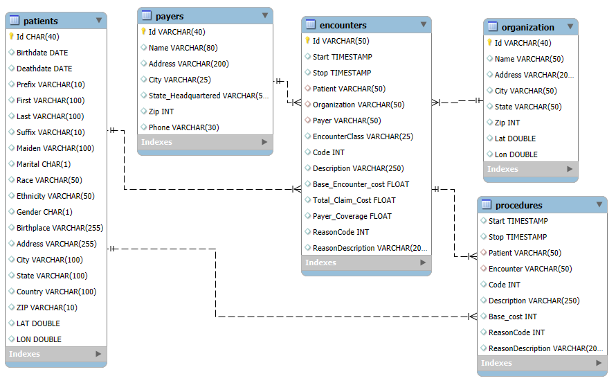

# 🏥 Hospital Analytics — SQL Project

An end-to-end SQL analysis of hospital encounter data, built in **MySQL**. The project answers 15+ business questions across four objectives: encounter volume, cost and coverage, patient behavior, and demographics and access to care.

---

## 📌 Project Overview

A hospital wants to understand how care patterns have shifted over time, where financial exposure comes from, which patients use the most care, and who its patient population is. This project turns those questions into SQL queries and documents the findings.

**Business questions:** see [`Business_problems.docx`](Business_problems.docx)

## 🗂️ Dataset

| Table | Rows | Description |
|---|---|---|
| `encounters` | 27,891 | Patient visits with class, dates, payer, base cost, total claim cost, payer coverage |
| `patients` | 974 | Demographics: birthdate, gender, race, ethnicity, marital status, city/state |
| `procedures` | 47,701 | Procedures performed during encounters, with base cost |
| `payers` | 10 | Insurance payers (including `NO_INSURANCE`) |
| `organizations` | 1 | Hospital details |

- **Time span:** 2011 – 2022 (2022 is a partial year, with only 220 encounters)
- **Source:** _add the dataset source / credit link here_
- **Zipped copy:** [`Dataset.zip`](Dataset.zip)

### Schema



## 🛠️ Tools & SQL Concepts

- **MySQL** (MySQL Workbench)
- CTEs, window functions (`LAG`), conditional aggregation (`CASE WHEN`), multi-table joins, date functions (`YEAR`, `QUARTER`, `TIMESTAMPDIFF`, `DATEDIFF`), pivot-style percentage tables, `UNION ALL` totals rows

## 📁 Repository Structure

```
Hospital_Analysis/
├── Objectives/
│   ├── Objective-1.sql      # Encounters overview
│   ├── Objective-2.sql      # Cost & coverage insights
│   ├── Objective-3.sql      # Patient behavior analysis
│   └── Objective-4.sql      # Demographics & access to care
├── Business_problems.docx   # Business question bank
├── Create_Tables.sql        # Database, tables, foreign keys
├── Importing_Tables.sql     # LOAD DATA scripts for the CSVs
├── Dataset.zip              # Source CSV files
├── Hospital_Schema.png      # Entity relationship diagram
└── README.md
```

## ▶️ How to Run

1. Unzip `Dataset.zip`.
2. Run `Create_Tables.sql` to create the `hospital` database, tables and foreign keys.
3. Open `Importing_Tables.sql` and **update the file paths** to where you unzipped the CSVs, then run it. (`local_infile` must be enabled on both server and client.)
4. Run any file in `Objectives/`. Each is self-contained and commented.

---

## 🔍 Key Insights

### Objective 1 — Encounters Overview
- **27,891 encounters** over 2011–2022. Volume peaked at **3,885 in 2014**, settled around 2,200–2,500 a year, and rose again to **3,530 in 2021**.
- **Ambulatory** is the largest class overall (~45%). Its share spiked to 60.3% in 2014 and drifted down to 36.9% by 2021.
- In **2021, outpatient jumped to 40.2%** (from ~20% in prior years) while inpatient fell to 1.6%, the biggest shift in the dataset.
- **95.9%** of encounters last under 24 hours; only **4.1%** run longer.

### Objective 2 — Cost & Coverage
- **48.7% of encounters (13,586)** had zero payer coverage. Of these, 8,807 were uninsured, but **~4,800 had a payer and still $0 coverage**.
- Total claims of **~$101.5M**: payers covered only **~31%**, leaving **~69%** as patient responsibility (66–77% every year from 2012 to 2021).
- **Most frequent procedures** are routine assessments and screenings, mostly at a flat **$431** base cost.
- **Highest average cost** procedures are rare (ICU admission ~$206K, CABG ~$47K). By total spend, **electrical cardioversion** (1,383 procedures × ~$25.9K ≈ **$35.8M**) is the largest cost driver.
- **Average claim cost by payer:** Medicaid is highest (~$6,205), followed by uninsured (~$5,593). Dual Eligible is lowest (~$1,696).

### Objective 3 — Patient Behavior
- Unique patients per quarter grew from **~155–170 (2011)** to **400+ (2021)**.
- **773 patients** had at least one encounter within 30 days of a previous one, but this counts *all* encounter types, so it mostly reflects routine follow-ups. Restricting to returns after an **inpatient stay** gives roughly 800 events across 85 patients.
- **12.3%** of patients (120 of 974) visited only once; **57%** (554) had **10+ encounters**. The patient base is dominated by repeat, high-utilization patients.

### Objective 4 — Demographics & Access
- **Age at first encounter:** 66+ (457, ~47%), 41–65 (301), 18–40 (216), and **no patients under 18**.
- **Average claim cost:** male $4,085 vs female $3,252; Hispanic $6,306 vs non-Hispanic $3,109. Native American patients have the highest average ($7,828) but represent only **11 patients**, so treat that with caution.
- **Geography:** all patients are in Massachusetts; **Boston** alone accounts for 541 of 974 patients.
- **Marital status:** married patients have a *higher* share of emergency (8.8% vs 5.7%) and urgent care (13.9% vs 9.1%) encounters than single patients, and about 30 encounters per patient vs 22.

---

## ⚠️ Limitations

- Single-hospital, Boston-centered dataset, so geographic comparisons are limited.
- 2022 is a partial year and should be excluded from trend comparisons.
- "Readmission" here includes any encounter within 30 days, not only hospital readmissions.
- Cost differences across demographic groups are aggregates and don't control for case mix or payer mix.

## 💡 Skills Demonstrated

Data modeling · SQL data import and cleaning · window functions · cohort-style patient analysis · translating business questions into queries · documenting findings and caveats

## 👤 Author

**Tanishq Choudhary**
[LinkedIn](https://www.linkedin.com/in/tanishq-choudhary-5a5971275/)
